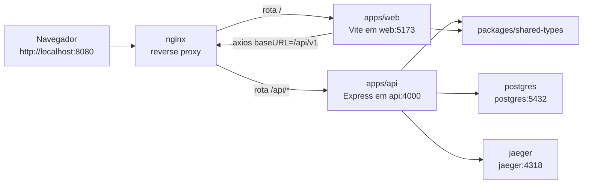

# tracking-okrs

Monorepo de uma aplicação de tracking de OKRs com frontend Vue 3, backend Express, PostgreSQL, Jaeger e Nginx.

O objetivo do produto é permitir que um usuário:

- cadastre quarters, objectives e key results;
- acompanhe progresso percentual de cada KR;
- mantenha documentação rica por KR, no estilo Notion ou Obsidian;
- visualize dashboards de progresso por KR, objetivo e quarter;
- consolide a visão geral de todos os OKRs de um quarter específico.

Este repositório contém o setup inicial da plataforma, com a fundação de frontend, backend, infraestrutura local e pacotes compartilhados.

## Arquitetura

O monorepo é organizado com `pnpm workspaces` e separado em três áreas principais:

- `apps/`: aplicações executáveis do sistema.
- `packages/`: pacotes compartilhados entre frontend e backend.
- `infra/`: arquivos de infraestrutura local, containers e proxy reverso.

### Apps

- `apps/web`: frontend em Vue 3 + Vite + TypeScript strict, organizado em MVVM, com Pinia, Tailwind, shadcn-vue, Vitest, Chart.js, Zod, vee-validate, axios e tiptap.
- `apps/api`: backend em Express + TypeScript strict, com Passport para autenticação local e GitHub, PostgreSQL com SQL raw, OpenAPI e tracing com OpenTelemetry exportado para Jaeger.

### Packages

- `packages/shared-types`: contratos e tipos compartilhados entre frontend e backend, como payloads de API e entidades base.
- `packages/eslint-config`: configuração central de ESLint usada pelos apps.
- `packages/tsconfig`: presets de TypeScript compartilhados para Node e Vue.

Cada app e cada pacote pode ter documentação própria depois. Este `README` cobre a visão geral do monorepo e a forma de executá-lo.

## Comunicação do Monorepo

No ambiente completo com Docker Compose, o navegador conversa apenas com o `nginx`. O proxy reverso decide se a requisição deve seguir para o frontend (`web`) ou para o backend (`api`).



### Como a comunicação acontece

- O usuário acessa `http://localhost:8080` e entra sempre pelo container `nginx`.
- Requisições para `/` e demais rotas de interface são encaminhadas para o upstream `tracking_okrs_web`, que aponta para `web:5173`.
- Requisições para `/api/` são encaminhadas para o upstream `tracking_okrs_api`, que aponta para `api:4000`.
- O frontend usa [apps/web/src/services/http.ts](/home/joaovpsguimaraes/apps/tracking-okrs/apps/web/src/services/http.ts) com `baseURL: '/api/v1'`, então chamadas de API saem do browser no mesmo host e porta do `nginx`.
- O backend expõe suas rotas em `/api/v1` dentro de [apps/api/src/app.ts](/home/joaovpsguimaraes/apps/tracking-okrs/apps/api/src/app.ts), acessa o PostgreSQL pelo hostname `postgres` e envia tracing para `jaeger`.
- `packages/shared-types` centraliza contratos compartilhados entre `web` e `api`, reduzindo divergência entre payloads e tipos.

### Como o Nginx balanceia `api` e `web`

- A configuração está em [infra/nginx/default.conf](/home/joaovpsguimaraes/apps/tracking-okrs/infra/nginx/default.conf).
- O upstream `tracking_okrs_api` usa `least_conn`, que é uma estratégia de balanceamento por menor número de conexões ativas.
- Hoje existe apenas um servidor no upstream da API (`server api:4000;`), então não há distribuição real de carga neste momento.
- Na prática atual, o `nginx` funciona como roteador e ponto único de entrada; o balanceamento da API passa a acontecer quando mais instâncias forem adicionadas ao upstream.
- O upstream `tracking_okrs_web` também aponta para um único serviço (`server web:5173;`), então o frontend também está publicado por roteamento, não por balanceamento entre múltiplas réplicas.

## Stack

### Backend

- ExpressJS
- TypeScript strict
- ESLint strict
- Prettier
- Passport local + GitHub OAuth
- PostgreSQL com SQL raw via `pg`
- OpenAPI
- OpenTelemetry + Jaeger

### Frontend

- Vue 3
- Vite
- TypeScript strict
- MVVM
- Pinia
- Tailwind CSS
- shadcn-vue
- Vitest
- Chart.js
- Zod
- date-fns
- lodash
- tiptap
- vee-validate
- axios

### Infra

- Docker Compose
- PostgreSQL
- Jaeger
- Nginx

## Estrutura do Repositório

```text
.
├── apps
│   ├── api
│   └── web
├── infra
│   ├── docker
│   ├── nginx
│   └── postgres
├── packages
│   ├── eslint-config
│   ├── shared-types
│   └── tsconfig
├── docker-compose.yml
├── package.json
└── pnpm-workspace.yaml
```

## Pré-requisitos

Para desenvolvimento local fora de containers:

- Node.js 22+
- pnpm 10+

Para execução containerizada:

- Docker
- Docker Compose

## Como Iniciar

Existem dois modos de execução local, mas eles não usam a mesma configuração de rede.

### Resumo rápido

| Objetivo | Comando principal | URL principal | Quando usar |
| --- | --- | --- | --- |
| Rodar a aplicação completa no navegador com proxy, API, banco e tracing integrados | `docker compose up -d --build` | `http://localhost:8080` | melhor opção para validar o fluxo completo da aplicação |
| Rodar os processos de desenvolvimento no host com hot reload | `pnpm dev` | web em `http://localhost:5173`, api em `http://localhost:4000` | útil para desenvolvimento local, lint, typecheck e debug dos apps separadamente |

### 1. Ambiente completo com Docker Compose

Esse é o modo mais próximo da topologia local prevista para a aplicação e o caminho mais confiável para abrir o sistema no navegador via `localhost`.

```bash
docker compose up -d --build
```

Serviços expostos:

- aplicação via Nginx: `http://localhost:8080`
- PostgreSQL no host: `localhost:5433`
- Jaeger UI: `http://localhost:16686`

Observações:

- internamente, o PostgreSQL continua em `5432` dentro da rede Docker;
- o mapeamento externo está em `5433` para evitar conflito com bancos já em execução na máquina;
- o Nginx publica frontend e backend sob o mesmo host, então o frontend consegue chamar `/api/v1` sem configuração adicional;
- os nomes `postgres` e `jaeger` só resolvem dentro da rede do Docker Compose.

#### 1.1 Como o backend roda dentro do Docker Compose

Quando a API roda pelo Compose, ela não deve usar `localhost` para falar com banco ou tracing. Dentro da rede Docker, ela precisa usar os nomes dos serviços definidos em [docker-compose.yml](/home/joaovpsguimaraes/apps/tracking-okrs/docker-compose.yml).

Configuração esperada do backend nesse modo:

```env
NODE_ENV=development
PORT=4000
APP_ORIGIN=http://localhost
SESSION_SECRET=development-session-secret
POSTGRES_HOST=postgres
POSTGRES_PORT=5432
POSTGRES_DB=tracking_okrs
POSTGRES_USER=postgres
POSTGRES_PASSWORD=postgres
GITHUB_CLIENT_ID=change-me
GITHUB_CLIENT_SECRET=change-me
GITHUB_CALLBACK_URL=http://localhost/api/v1/auth/github/callback
OTEL_EXPORTER_OTLP_ENDPOINT=http://jaeger:4318
```

Nesse cenário:

- `POSTGRES_HOST=postgres` aponta para o container do banco;
- `POSTGRES_PORT=5432` é a porta interna do serviço PostgreSQL na rede Docker;
- `OTEL_EXPORTER_OTLP_ENDPOINT=http://jaeger:4318` aponta para o container do Jaeger;
- `APP_ORIGIN=http://localhost` representa a origem pública usada pelo navegador ao acessar a aplicação via Nginx.

#### 1.2 Como o Nginx publica o backend em `localhost`

O Nginx do Compose é o ponto de entrada HTTP da aplicação e publica a porta `8080` do host para a porta `80` do container.

Fluxo de rede:

- navegador -> `http://localhost:8080`
- Nginx -> `web:5173` para rotas de frontend
- Nginx -> `api:4000` para rotas `/api/`

Na configuração atual de [infra/nginx/default.conf](/home/joaovpsguimaraes/apps/tracking-okrs/infra/nginx/default.conf):

- `location /` encaminha para o upstream `tracking_okrs_web`
- `location /api/` encaminha para o upstream `tracking_okrs_api`

Isso significa que, com o Compose ativo:

- frontend: `http://localhost:8080/`
- healthcheck da API: `http://localhost:8080/api/v1/health`
- OpenAPI UI: `http://localhost:8080/api/v1/docs`

Se o objetivo for usar a aplicação completa via navegador em `localhost`, este é o modo recomendado.

Para derrubar os serviços:

```bash
docker compose down
```

Para derrubar os serviços e remover volumes:

```bash
docker compose down -v
```

### 2. Desenvolvimento local com `pnpm dev`

Use esse modo quando quiser rodar Vite e a API diretamente na sua máquina, fora de containers.

#### 2.1 Instale as dependências

```bash
pnpm install
```

#### 2.2 Suba dependências externas primeiro

Se quiser reaproveitar os serviços de infraestrutura do projeto sem rodar toda a stack, suba pelo menos PostgreSQL e Jaeger com Docker:

```bash
docker compose up -d postgres jaeger
```

Isso expõe:

- PostgreSQL em `localhost:5433`
- OTLP HTTP do Jaeger em `http://localhost:4318`

#### 2.3 Configure o backend para rodar no host

O arquivo [apps/api/.env.example](/home/joaovpsguimaraes/apps/tracking-okrs/apps/api/.env.example) usa nomes internos do Compose, então ele precisa ser ajustado para uso via `localhost`.

Garanta que [apps/api/.env](/home/joaovpsguimaraes/apps/tracking-okrs/apps/api/.env) contenha valores compatíveis com execução no host:

```env
NODE_ENV=development
PORT=4000
APP_ORIGIN=http://localhost:5173
SESSION_SECRET=change-me-please
POSTGRES_HOST=localhost
POSTGRES_PORT=5433
POSTGRES_DB=tracking_okrs
POSTGRES_USER=postgres
POSTGRES_PASSWORD=postgres
RESEND_API_KEY=change-me
RESEND_FROM_EMAIL=no-reply@example.com
RESEND_FROM_NAME=Tracking OKRs
GITHUB_CLIENT_ID=change-me
GITHUB_CLIENT_SECRET=change-me
GITHUB_CALLBACK_URL=http://localhost:4000/api/v1/auth/github/callback
OTEL_EXPORTER_OTLP_ENDPOINT=http://localhost:4318
```

Importante:

- `POSTGRES_HOST=postgres` funciona apenas quando a API roda dentro do Docker Compose;
- `POSTGRES_PORT=5433` é a porta publicada no host pelo Compose deste repositório;
- `APP_ORIGIN=http://localhost:5173` libera CORS para o frontend do Vite.

#### 2.4 Suba os apps em paralelo

```bash
pnpm dev
```

Endereços nesse modo:

- frontend Vite: `http://localhost:5173`
- backend Express: `http://localhost:4000`
- docs da API: `http://localhost:4000/api/v1/docs`

#### 2.5 Observação importante sobre o frontend no modo host

Hoje o frontend usa `/api/v1` como base relativa em [apps/web/src/services/http.ts](/home/joaovpsguimaraes/apps/tracking-okrs/apps/web/src/services/http.ts). Isso significa que o fluxo end-to-end no navegador foi pensado para rodar atrás do Nginx do Compose.

Na prática:

- para validar a aplicação completa no navegador, prefira `http://localhost:8080` com Docker Compose;
- `pnpm dev` é ótimo para desenvolvimento dos processos separadamente e para hot reload do frontend e da API;
- se você abrir apenas `http://localhost:5173`, chamadas de API podem exigir ajuste adicional de proxy no Vite ou mudança da base URL do frontend.

## Scripts Disponíveis

Na raiz do monorepo:

```bash
pnpm dev
pnpm build
pnpm lint
pnpm typecheck
pnpm test
pnpm format
pnpm format:write
```

## Como o Nginx Funciona na Aplicação

O Nginx é o ponto de entrada HTTP do ambiente local containerizado.

Ele tem três responsabilidades principais:

1. receber as requisições externas do cliente;
2. encaminhar chamadas de frontend para o app Vue;
3. encaminhar chamadas de API para o backend Express.

### Fluxo de requisição

Quando a stack está no ar:

- o navegador acessa `http://localhost:8080`;
- o Nginx recebe a requisição;
- requisições para `/` são encaminhadas para o serviço `web`;
- requisições para `/api/` são encaminhadas para o serviço `api`.

Em termos práticos:

- `http://localhost:8080/` -> frontend Vue/Vite
- `http://localhost:8080/api/v1/health` -> backend Express

### Benefícios dessa abordagem

- frontend e backend ficam sob o mesmo host no ambiente local;
- o frontend pode usar `/api/v1` como base sem depender de URL separada;
- reduz necessidade de configuração extra de CORS no fluxo principal;
- cria uma base simples para evoluir para balanceamento de carga do backend.

### Balanceamento de carga

O arquivo [infra/nginx/default.conf](/home/joaovpsguimaraes/apps/tracking-okrs/infra/nginx/default.conf) já define upstreams para `web` e `api`.

O upstream da API foi preparado para balanceamento com `least_conn`, o que permite evoluir para múltiplas instâncias do backend quando necessário. Hoje o Compose sobe uma instância da API, mas a configuração do proxy já está pronta para esse próximo passo.

## Banco de Dados e Observabilidade

### PostgreSQL

O PostgreSQL é iniciado pelo Compose com script inicial em [infra/postgres/init.sql](/home/joaovpsguimaraes/apps/tracking-okrs/infra/postgres/init.sql).

Esse arquivo cria a base inicial para:

- `users`
- `auth_accounts`
- `quarters`
- `objectives`
- `key_results`

O backend usa somente SQL raw via `pg`. Não há ORM no projeto.

### Jaeger

O backend exporta traces via OpenTelemetry para o Jaeger.

Interface local:

- `http://localhost:16686`

Isso permite acompanhar requests, latência e tracing distribuído conforme a API crescer.

## Convenções do Projeto

### Frontend

No frontend, a separação principal é:

- `views/`: telas
- `view-models/`: orquestração de tela
- `models/`: regras de negócio puras
- `services/`: integração HTTP
- `stores/`: estado global com Pinia
- `components/`: componentes de interface

### Backend

No backend, a separação principal é:

- `routes/`: definição das rotas HTTP
- `modules/`: organização por domínio
- `controllers/`: entrada HTTP
- `services/`: regras de aplicação
- `repositories/`: acesso ao banco com SQL raw
- `db/`: pool e utilitários de banco
- `docs/`: OpenAPI
- `telemetry/`: tracing

## Validação do Setup

Os comandos abaixo foram usados para validar o setup:

```bash
pnpm install
pnpm typecheck
pnpm lint
pnpm build
pnpm test
docker compose config
docker compose up -d --build
```

Resultados esperados:

- workspace instalado com sucesso;
- lint sem erros;
- typecheck sem erros;
- build do frontend e backend funcionando;
- teste inicial de model do frontend passando;
- stack Docker subindo com `postgres`, `jaeger`, `api`, `web` e `nginx`.

## Próximos Passos

Depois do setup inicial, a evolução natural do projeto é:

- implementar CRUD de quarters;
- implementar objectives e key results;
- adicionar tracking histórico de progresso por KR;
- implementar editor rico para documentos de KR;
- criar dashboards reais por quarter e por objetivo;
- adicionar migrations SQL versionadas;
- adicionar CI/CD e automações de qualidade.
